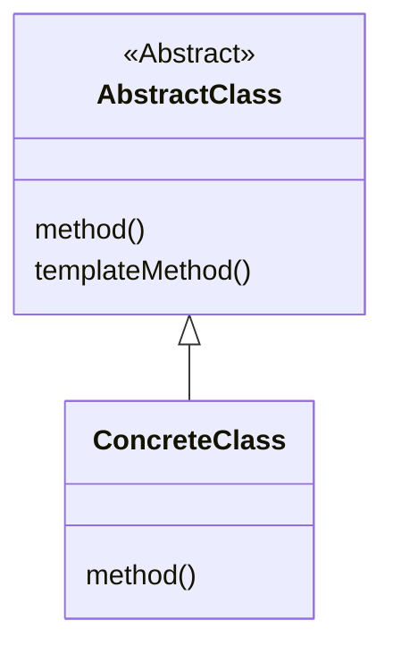

# 设计模式之模版方法模式

## 一、什么是模版方法模式？

在父类中定义处理流程的框架，在子类中实现具体处理的模式就称为`Template method`模式。具体的说就是在父类中定义组成模版的方法，由于是抽象方法，所以我们只会知道父类如何调用这些方法。实现上述这些抽象方法的是子类，所以我们只需要继承模版方法的抽象类，而对于具体的子类我们可以实现不同的处理方式，不论子类中的具体实现如何，处理流程都会按照父类中所定义的那样进行。

## 二、示例程序

此处我们依据书中列举打印字符的方法

1. 设置抽象类定义公共方法和模版方法

   ```java
   public abstract class AbstractDisplay {
     public abstract void open();

     public abstract void print();

     public abstract void close();

     public final void display(){
       open();
       for(int i=0;i < 5;i++){
         print();
       }
       close();
     }
   }
   ```

2. 定义完抽象类和具体的模版方法，我们就可以实现具体的子类，此处我们只列举一个打印字符的子类

   ```java
   public class CharDisplay extends AbstractDisplay {
     private char achar;

     public CharDisplay(char achar){
       this.achar = achar;
     }

     @Override
     public void open(){
       System.out.print("<<");
     }

     @Override
     public void print(){
       System.out.print(achar);
     }

     @Override
     public void close(){
       System.out.println(">>")
     }
   }
   ```

3. 到这里我们的方法的的具体实现也就完成了，我们便可以进行测试具体的实现

   ```java
   public class TemplateMethodTest {
     public static void main(String [] args){
       AbstractDisplay abstractDisplay = new CharDisplay();

       abstractDisplay.display();
     }
   }
   ```

4. 到这里我们的测试也就结束了，我们来看看它的类图，然后具体说说这个模版方法模式

   ```mermaid
   classDiagram
      AbstractDisplay <|-- CharDisplay
      <<Abstract>> AbstractDisplay
      AbstractDisplay:open()
      AbstractDisplay:print()
      class CharDisplay{
       open();
       print();
       close();
      }
   ```

   

## 三、模式详解

### 使用到的角色

1. #### 抽象类

   负责实现模版的方法，以及生命在模版方法中使用到的抽象方法，这些抽象方法会由子类`具体类`实现，此处的抽象类就相当于我们示例程序中的`AbstractDisplay`。

2. #### 具体类

   负责具体实现`抽象类`中定义的抽象方法，此处实现的方法将会在抽象类角色的模版方法中被调用，此处的具体类就相当于我们示例程序中的`CharDisplay`。

### 模式实现类图




### 哪我们什么时候会用到模版方法呢？

假设我们不使用模版方法，只是单纯的实现了很多具体的子类，如果立即出现问题，那么我们修改，查找漏洞的代价就非常的高，加入我们使用模版方法设计模式的话 我们只需要检查，修改模版方法即可解决问题
